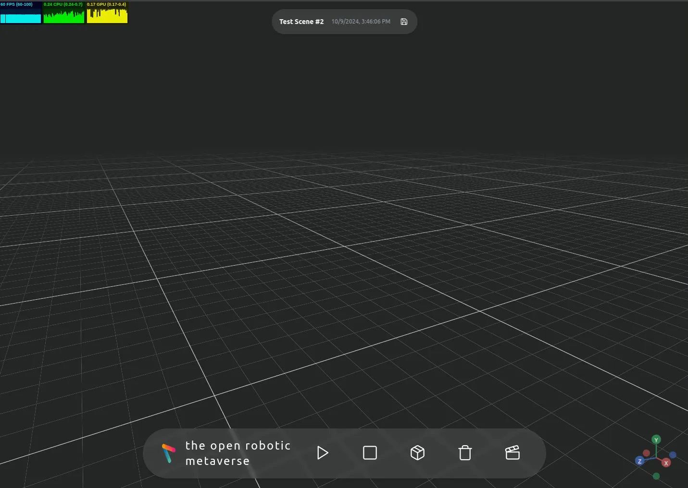

# MVP Documentation

## **1. Project Overview**

This iteration of the MVP is a 3D scene management application that allows users to create, manipulate, and visualize 3D scenes with objects and robots. The application is built using:

- [React TypeScript](https://react.dev/learn) for the frontend
- [MobX](https://mobx.js.org/README.html) for state management
- [Three.js](https://threejs.org/) (via [react-three-fiber](https://r3f.docs.pmnd.rs/getting-started/introduction)) for 3D rendering
- [Django](https://www.djangoproject.com/start/) for Backend
- [PostgresSQL](https://www.postgresql.org/) Database

### 1.1 Backend Data Model

This diagram illustrates the data model and relationships for the MVP's 3D scene management application. It's divided into two main sections:

1. Scene Management (pink section):

Shows the structure of Scene, AbstractObject, Object, and Robot entities.
Scene has properties like ID, name, user_id, and timestamps.
AbstractObject is a base class with common properties like position, orientation, and scale.
Object and Robot inherit from AbstractObject, with Object having a color property and Robot having joint_angles.

2. Object Library (blue section):

Displays the structure of AbstractReference, ReferenceObject, and ReferenceRobot.
AbstractReference contains common properties like ID, name, file, and description.
ReferenceRobot and ReferenceObject inherit from AbstractReference, with ReferenceRobot having a num_joints property.


## **2. API Structure**

The API is structured into two main sections:

### 2.1 Object Library

- Reference Robots (`/library/ref-robots/`)
- Reference Objects (`/library/ref-objects/`)

### 2.2 Scene Manager

- Scenes (`/scene-manager/scenes/`)
- Robots (`/scene-manager/robots/`)
- Objects (`/scene-manager/objects/`)

Each endpoint supports standard CRUD operations (GET, POST, PUT, PATCH, DELETE).

## **3. Data Models**

The project uses several key interfaces to represent data:

### 3.1 Base Interfaces

- `IAbstractObject`: Base interface for objects and robots
- `IAbstractReference`: Base interface for object and robot references

### 3.2 Scene Management Interfaces

- `IScene`: Represents a 3D scene
- `IObject`: Represents an object in a scene (extends `IAbstractObject`)
- `IRobot`: Represents a robot in a scene (extends `IAbstractObject`)

### 3.3 Object Library Interfaces

- `IReferenceRobot`: Represents a reference robot (extends `IAbstractReference`)
- `IReferenceObject`: Represents a reference object (extends `IAbstractReference`)

## **4. State Management**

The project uses MobX for state management. This section provides a detailed look at each store, its purpose, key observables, and important actions.

### 4.1 BaseStore

`BaseStore` is a generic abstract class that provides common functionality for other stores.

Key features:

- `@observable items`: An array to store the main data of the store.
- `@observable state`: Represents the current state of the store (idle, loading, success, or error).
- `fetchItems`: A protected method to fetch items from an API.
- `updateItem`: A protected method to update an item in the store.
- `deleteItem`: A protected method to delete an item from the store.
- `getItemById`: A method to retrieve an item by its ID.

### 4.2 LibraryStore

`LibraryStore` manages the state of reference objects and robots.

Key observables:

- `@observable referenceObjects`: An array of `IReferenceObject`.
- `@observable referenceRobots`: An array of `IReferenceRobot`.

Important actions:

- `@action fetchLibraryData`: Fetches both reference objects and robots from the API.
- `getReferenceObjectById`: Retrieves a reference object by its ID.
- `getReferenceRobotById`: Retrieves a reference robot by its ID.

### 4.3 SceneStore

`SceneStore` manages the state of scenes.

Key observables:

- `@observable activeSceneId`: The ID of the currently active scene.
- `@observable newSceneName`: The name for a new scene being created.

Important actions:

- `@action setActiveScene`: Sets the active scene by ID.
- `@action fetchScenes`: Fetches all scenes from the API.
- `@action createScene`: Creates a new scene.
- `@action updateScene`: Updates an existing scene.
- `@action deleteScene`: Deletes a scene.

Computed values:

- `@computed get activeScene`: Returns the currently active scene object.

### 4.4 ObjectStore

`ObjectStore` manages the state of objects in scenes.

Key observables:

- Inherits `@observable items` from BaseStore, which stores `IObject` instances.

Important actions:

- `@action fetchObjects`: Fetches all objects from the API.
- `@action createObject`: Creates a new object.
- `@action updateObject`: Updates an existing object.
- `@action deleteObject`: Deletes an object.
- `@action getObjectsForScene`: Retrieves all objects for a specific scene.

### 4.5 RobotStore

`RobotStore` manages the state of robots in scenes.

Key observables:

- Inherits `@observable items` from BaseStore, which stores `IRobot` instances.

Important actions:

- `@action fetchRobots`: Fetches all robots from the API.
- `@action createRobot`: Creates a new robot.
- `@action updateRobot`: Updates an existing robot.
- `@action deleteRobot`: Deletes a robot.
- `@action getRobotsForScene`: Retrieves all robots for a specific scene.

### 4.6 ErrorStore

`ErrorStore` manages application-wide errors.

Key observables:

- `@observable errors`: An array of Error objects.

Important actions:

- `@action addError`: Adds a new error to the store.
- `@action clearErrors`: Clears all errors from the store.

### 4.7 Leveraging MobX in the 3D Application

MobX provides powerful tools for managing state in your 3D application. Here's how you can leverage MobX concepts within the current state management structure:

#### 4.7.1 Observables

Observables are at the core of MobX. In our stores, we use observables to track various aspects of the application state:

- In `SceneStore`: `@observable activeSceneId` tracks the current scene.
- In `ObjectStore` and `RobotStore`: `@observable items` arrays store the objects and robots.
- In `LibraryStore`: `@observable referenceObjects` and `@observable referenceRobots` store available models.

Example usage:

```typescript
@observable activeSceneId: string | null = null;
```

#### 4.7.2 Computed Values

Computed values derive information from observables. They're used throughout our stores to calculate values based on the current state:

- In `SceneStore`: `@computed get activeScene()` returns the currently active scene object.

Example usage:

```typescript
@computed get activeScene(): IScene | undefined {
  return this.items.find((scene) => scene.id === this.activeSceneId);
}
```

#### 4.7.3 Actions

Actions are methods that modify the state. All state modifications in our stores are wrapped in `@action` decorators:

- In `SceneStore`: `@action setActiveScene()`, `@action createScene()`, etc.
- In `ObjectStore` and `RobotStore`: `@action createObject()`, `@action updateRobot()`, etc.

Example usage:

```typescript
@action
setActiveScene(sceneId: string | null) {
  this.activeSceneId = sceneId;
}
```

#### 4.7.4 Reactions

While not explicitly defined in our stores, reactions are used in components to respond to state changes. For example, in the `MainScene` component, we use `useEffect` to show toast messages when the scene store state changes.

Example usage:

```typescript
useEffect(() => {
  if (sceneStore.state.status === "error") {
    toast({
      variant: "destructive",
      title: "Error",
      description: sceneStore.state.error,
    });
  }
}, [sceneStore.state.status]);
```

#### 4.7.5 Applying MobX to 3D Rendering

To leverage MobX in the 3D aspects of your application:

1. **Scene Management**:

Use `SceneStore` to manage the overall scene state.

React to changes in `activeSceneId` to load or unload 3D content.

2. **Object Manipulation**:

   - Use `ObjectStore` and `RobotStore` to manage individual 3D entities.
     Create actions for transforming objects (move, rotate, scale).

3. **Real-time Updates**:
   Make your 3D components observers of relevant stores.
   This ensures they re-render when the observed state changes.
4. **Performance Optimization**:
   Use computed values for expensive calculations in the 3D scene.
   This helps avoid unnecessary recalculations.
5. **User Interactions**:
   Tie user interactions (like clicking on a 3D object) to MobX actions.
   This keeps all state changes centralized and trackable.

Example of a 3D component using MobX:

```typescript
const SceneObject = observer(({ objectId }) => {
  const object = objectStore.getItemById(objectId);

  useFrame(() => {
    // Update object's 3D representation based on its state
    // This will automatically re-run when the object's state changes
  });

  return (
    <mesh position={object.position} rotation={object.rotation}>
      {/* Object geometry and material */}
    </mesh>
  );
});
```

### 4.8 Store Interactions

The stores interact with each other and the components in several ways:

1. **SceneStore and ObjectStore/RobotStore**: When a scene is selected in SceneStore, ObjectStore and RobotStore use the active scene ID to filter and display relevant objects and robots.
2. **LibraryStore and ObjectStore/RobotStore**: When creating new objects or robots, the reference data from LibraryStore is used to populate the initial properties.
3. **ErrorStore and other stores**: All other stores use ErrorStore to log errors that occur during API calls or other operations.
4. **Stores and Components**: React components use the `observer` HOC from MobX to automatically re-render when relevant observables change. They also call store actions to update the application state.

### 4.9 MobX Best Practices Used

1. **Derivations**: Computed values like `activeScene` in SceneStore are used for derived state.
2. **Actions**: All state modifications are wrapped in `@action` decorators to ensure they're tracked by MobX.
3. **Reactions**: Components use `useEffect` with MobX observables to trigger side effects when state changes.
4. **Batching Updates**: `runInAction` is used in asynchronous actions to batch updates and reduce re-renders.

## **5. UI Components**

### 5.1 SceneSelector

- Allows users to select and manage scenes
- Displays a grid of available scenes
- Provides functionality to create new scenes

.png)

### 5.2 ModelBrowser

- Displays a list of available models (primitive shapes, custom objects, and robots)
- Allows users to search and filter models
- Provides functionality to add models to the active scene

.png)

### 5.3 MainScene

- Main component for rendering the 3D scene
- Handles different states (loading, error, no active scene)
- Renders the Canvas component when a scene is active



## **6. 3D Rendering**

The project uses react-three-fiber for 3D rendering. Key components include:

### 6.1 SceneContent

- Renders the content of the active scene
- Manages the creation, updating, and removal of 3D objects

### 6.2 SceneObject and SceneRobot

- Render individual objects and robots in the scene

### 6.3 CustomTransformControls

- Provides controls for transforming (moving, rotating, scaling) objects in the scene

### 6.4 SceneEnvironment

- Sets up the 3D environment (lights, grid, controls)

### 6.5 renderObject and renderRobot

- Helper functions for rendering objects and robots

## **7. API Integration**

The `api.ts` file provides functions for interacting with the backend API:

### 7.1 sceneManagerApi

- Functions for managing scenes, objects, and robots

### 7.2 objectLibraryApi

- Functions for managing reference objects and robots

These functions handle API requests, responses, and error handling, integrating with the toast notification system for user feedback.
